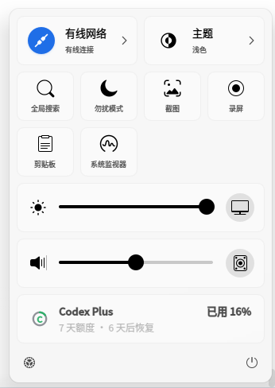
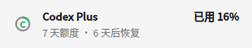
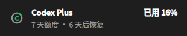
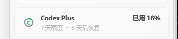
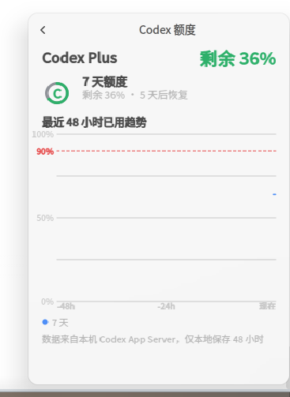

# dde-codex-monitor — DDE Dock 的 Codex 额度监控插件

[](LICENSE)
[]()
[]()

在 **deepin / UOS v25** 任务栏上直接查看你的 **OpenAI Codex** 订阅额度：
不用打开 Codex CLI 或网页，托盘图标一眼看到用量，快捷面板展示套餐、已用百分比和恢复倒计时。

> 通过 Codex App Server 的 stdio 模式（`codex app-server --listen stdio://`）读取额度，
> 复用现有登录状态，不读取 `~/.codex/auth.json`，不抓取网页，不调用私有 HTTP 接口。



*亮暗主题卡片效果：*




*真实运行效果（deepin 25 任务栏）：*





## ✨ 功能特性

- **托盘状态图标**：灰色底环 + 彩色圆弧表示已用比例，中间字母 `C`（耗尽时变 `!`）；
  绿色=正常，橙色=接近上限（≥70%），红色=即将耗尽（≥90%），灰色=无数据/读取失败。
- **快捷面板额度卡片**：套餐类型（如 Plus）、剩余百分比、额度周期（5 小时 / 7 天，以服务端为准）、恢复倒计时、底部剩余额度进度条；点击右侧 `›` 打开详情页。
- **详情页与趋势图**：双窗口环形图 + 最近 48 小时已用曲线（90% 预警线），历史仅本地保存。
- **消耗速度预测**："还能用约 X"按最近消耗速度（优先近 30 分钟）估算；检测到本机 Codex 会话**正在使用**时按速率实时外推，盯屏时数字逐分钟走动，停用即冻结。
- **额度系统通知**：额度恢复、用满 70%/90% 阈值时弹系统通知（带"打开桌面版"动作，可整体关闭）；不增加任何额外网络请求。
- **右键菜单**：查看详情 / 立即刷新 / 打开 Codex 桌面版 / 复制额度信息 / 额度通知开关。
- **双额度窗口**：同时存在 5 小时与 7 天窗口时逐行展示，以最接近上限的窗口决定图标状态。
- **自动刷新**：启动读取一次、每 5 分钟刷新、收到服务端额度变化通知立即更新、每分钟本地走字（倒计时/外推）、挂起唤醒后立即刷新。
- **手动刷新**：单击托盘图标或点击额度卡片立即重新读取（图标短暂变灰提示）。
- **双击打开桌面版**：双击托盘图标启动 [Codex 桌面版](#-双击打开-codex-桌面版)（经 `dde-am` 启动，正确处理 Wayland 窗口激活）。
- **异常状态提示**：区分"正在读取 / 未找到 Codex CLI / 未登录 / 读取失败 / 无可用额度"。
- **亮暗主题自适应**：不使用固定背景色，文本颜色跟随系统调色板。


## 📋 环境要求

- 系统：deepin / UOS v25（DDE 任务栏 v2，dde-tray-loader ≥ 2.0）
- 编译：CMake ≥ 3.16、C++17、Qt6（Core / Gui / Widgets）
- 依赖开发包：`dde-tray-loader-dev`、`qt6-base-dev`
- 运行时：本机已安装 [Codex CLI](https://github.com/openai/codex) 并用 ChatGPT 账号登录
- 可选：[Codex 桌面版](https://learn.chatgpt.com/docs/linux/linux-app)（双击托盘图标打开，未安装不影响额度监控）

## 🔨 构建与安装

```bash
sudo apt install build-essential cmake qt6-base-dev dde-tray-loader-dev

cmake -S . -B build -DCMAKE_BUILD_TYPE=Release
cmake --build build -j"$(nproc)"
```

> Deepin 25 的 `/usr` 是只读的，`sudo cmake --install` 会报
> `Read-only file system`；需要打包成 deb 走 apt（经 overlay 层写入）安装：

```bash
install -D build/libdde-codex-monitor.so \
  packaging/dde-codex-monitor/usr/lib/dde-dock/plugins/libdde-codex-monitor.so
dpkg-deb --build --root-owner-group packaging/dde-codex-monitor
sudo apt install -y packaging/dde-codex-monitor.deb
```

升级时记得先递增 `packaging/dde-codex-monitor/DEBIAN/control` 里的版本号，
否则同版本号 apt 不会覆盖安装。

安装后重启任务栏（或重新登录）生效：

```bash
systemctl --user restart dde-shell@DDE.service
```

> 没有安装 `dde-tray-loader-dev` 时，可从
> [dde-tray-loader](https://github.com/linuxdeepin/dde-tray-loader) 仓库的
> `interfaces/` 目录拉取接口头文件，通过 `-DDDE_TRAY_LOADER_INCLUDE_OVERRIDE=<头文件目录>`
> 指定即可编译（也可直接让 AI 助手完成这一步）。

## 🖱 双击打开 Codex 桌面版

双击托盘图标会启动官方 **ChatGPT/Codex 桌面应用**（Linux 预览版，deb 包，来自
[官方安装指南](https://learn.chatgpt.com/docs/linux/linux-app)）：

```bash
# 下载并安装官方 deb（Ubuntu/Debian 系，含 deepin 25）
curl -fL -o /tmp/chatgpt_amd64.deb \
  "https://persistent.oaistatic.com/codex-app-prod/linux/deb/latest/chatgpt_amd64.deb"
sudo apt install -y /tmp/chatgpt_amd64.deb
```

安装后应用入口为 `chatgpt`（`/usr/share/applications/chatgpt.desktop`）。插件按
XDG 规范查找 `chatgpt.desktop`，解析其中的 `Exec` 并脱离启动；找不到桌面版时，
双击后鼠标悬停图标会短暂提示原因。

查找顺序：

1. 环境变量 `DDE_CODEX_MONITOR_DESKTOP_ENTRY` 指定的 desktop 文件（路径或文件名）
2. `$XDG_DATA_HOME/applications/chatgpt.desktop`（默认 `~/.local/share/applications`）
3. `XDG_DATA_DIRS` 各目录下的 `applications/chatgpt.desktop`（含 `/usr/share/applications`）

> 单击刷新需要等待系统双击间隔（通常 400ms）后触发，用于区分单击与双击；
> 快捷面板卡片仍是单击立即刷新。

## 🔮 消耗预测与数据存储

- **预测**：按额度窗口分组采样（每分钟心跳 + 每 5 分钟刷新 + 服务端推送），对最近
  30 分钟样本做线性回归得到消耗速度（%/小时），样本不足退回 2 小时窗口；
  "还能用约 X"= 剩余比例 ÷ 当前速度，估算耗尽时间晚于窗口重置时不显示。
- **使用中实时外推**：每分钟扫描一次本机 Codex 会话进程（TUI / `codex exec` 等，
  排除本插件与桌面版自带的 app-server 守护）。检测到使用中时，剩余比例与倒计时按
  速度从最后一次采样实时外推（上限 15 分钟），解决"盯着看时数据未刷新"的滞后；
  未使用时数值冻结。
- **存储**：采样历史保存在 `$XDG_DATA_HOME/dde-codex-monitor/history.json`
  （默认 `~/.local/share/…`），仅本地、只保留 48 小时；通知开关保存在 Dock 的
  插件配置（`dde-dock.conf`）中。
- **通知**：额度恢复 / 用满 70% / 用满 90% 时经 `org.freedesktop.Notifications`
  发送（deepin 通知中心），恢复通知带"打开桌面版"动作；右键菜单可整体关闭。
  通知只由既有数据变化触发，不产生额外网络请求。

## 📌 注册到快捷面板

插件托盘图标随插件加载自动出现；**快捷面板卡片**需要在
`quickPlugins` 配置中注册 `codex-monitor`（该配置项为只读，普通用户不可写）。
在支持写入的系统上：

```bash
dde-dconfig get -a org.deepin.ds.dock -r org.deepin.ds.dock.tray -k quickPlugins
```

保留原有列表并追加 `"codex-monitor"` 后写回。若 `dde-dconfig set` 提示无权限
（本机实测），可写入系统覆盖文件（`dsg.config.override` 格式）：

```bash
sudo mkdir -p /etc/dsg/configs/overrides/org.deepin.ds.dock/org.deepin.ds.dock.tray
```

```json
{
  "magic": "dsg.config.override",
  "version": "1.0",
  "contents": {
    "quickPlugins": {
      "value": ["network", "bluetooth", "...原有插件...", "codex-monitor"],
      "serial": 0
    }
  }
}
```

写入后重启 `dde-dconfig-daemon.service` 与 dde-shell 生效。

## 🔎 Codex CLI 查找顺序

1. 环境变量 `DDE_CODEX_MONITOR_CODEX_BIN` 指定路径
2. `PATH` 中的 `codex`
3. `~/.local/bin/codex`
4. `~/.nvm/versions/node/*/bin/codex`（取最新）

若找到的是 NVM 中的 Codex，插件会把其 `bin` 目录前置到子进程 `PATH`，
解决 `/usr/bin/env node` 找不到 Node.js 的问题。

## 📁 项目结构

```text
.
├── CMakeLists.txt
├── packaging
│   └── dde-codex-monitor           # deb 打包目录（DEBIAN/control + usr/…）
├── src
│   ├── codex-monitor.json          # 插件元数据 {"api": "2.0.0"}
│   ├── codexmonitorplugin.*        # PluginsItemInterfaceV2 插件主体（菜单/通知/详情页接线）
│   ├── codexappserverclient.*      # QProcess + JSONL：App Server 客户端（含会话活动扫描）
│   ├── codexdesktoplauncher.*      # 查找并启动 Codex 桌面版（优先 dde-am）
│   ├── codexhistory.*              # 采样历史/消耗速度估算（XDG 数据目录持久化）
│   ├── codexnotifier.*             # 系统通知（org.freedesktop.Notifications）
│   └── quotawidgets.*              # 托盘图标 / 卡片 / 详情页（QPainter 绘制）
└── docs/screenshots
```

## 📄 设计文档

需求与验收标准见 [DESIGN.md](DESIGN.md)（第一版范围：无独立窗口、无设置页、无后台服务、
无数据库、无趋势图，异常不得导致任务栏崩溃）。

## ⚖️ 许可证

[LGPL-3.0-or-later](LICENSE)
